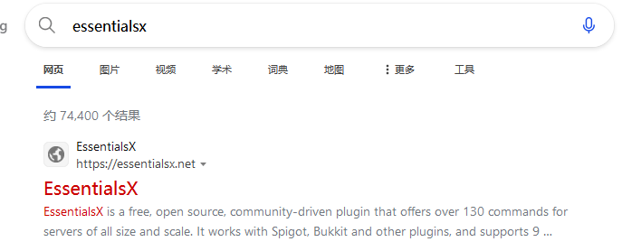

# 概览

> `官网` https://essentialsx.net/
>
> `bukkit` https://dev.bukkit.org/projects/essentialsx
>
> `spigotmc` https://www.spigotmc.org/resources/.9089/
>
> `GitHub` https://github.com/EssentialsX/Essentials

Essentials插件分为两个版本：

- essentials 适合mc 1.7.10 [下载](https://mineplugin.org/Essentials/Downloads)
- essentialsX 适合mc 1.8+ [下载]()

 
怎么找到官网并从官网下载essx

> 建议选择`稳定版本`
>
> Stable release 稳定版本
>
> Development build 开发版本
>
> 真的有那么多人不知道自己下的开发版。。。

