# 概览

## 如何下载插件历史版本?

**建议**您用**最新版本**的插件,但如果您因为一些原因必须要用旧版的话...

<details>
<summary>bukkit</summary>

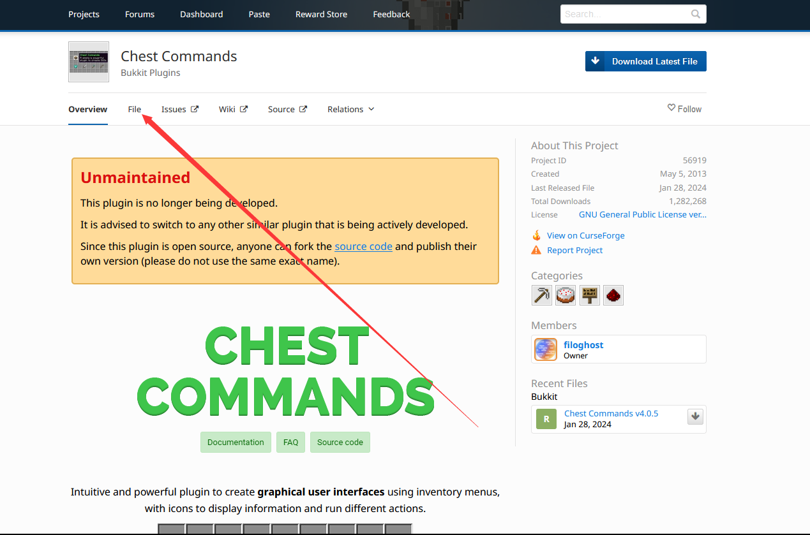

点击左侧文字可以查看详细内容

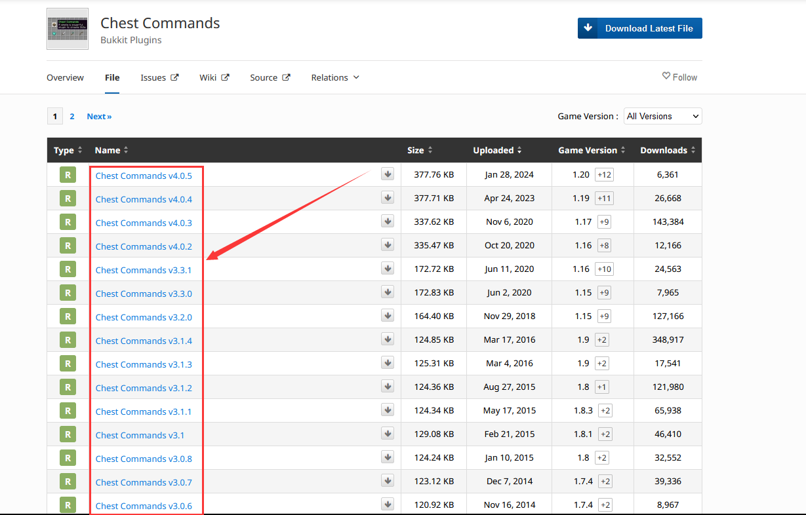

这是更新日志

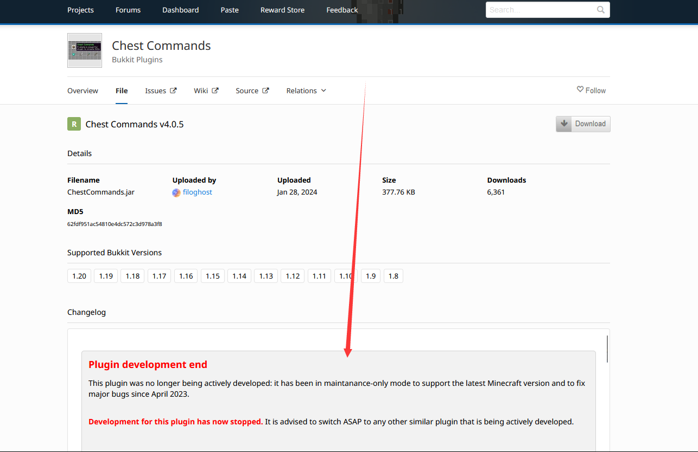

</details>

<details>
<summary>spigotmc</summary>

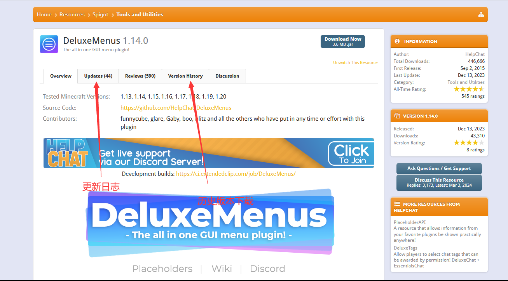

</details>

<details>
<summary>GitHub</summary>

在 Releases 中往下翻

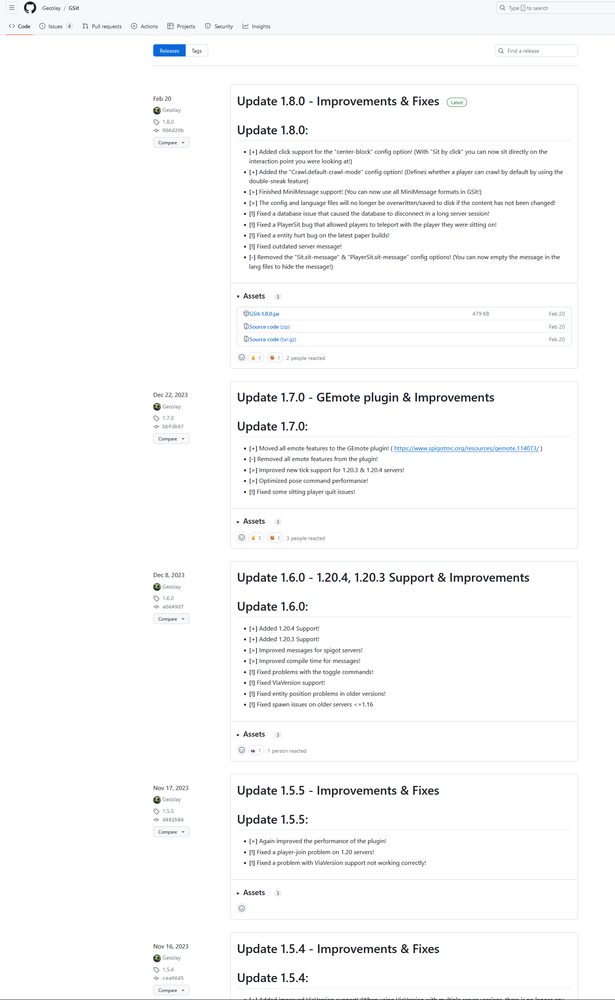

或者这样子

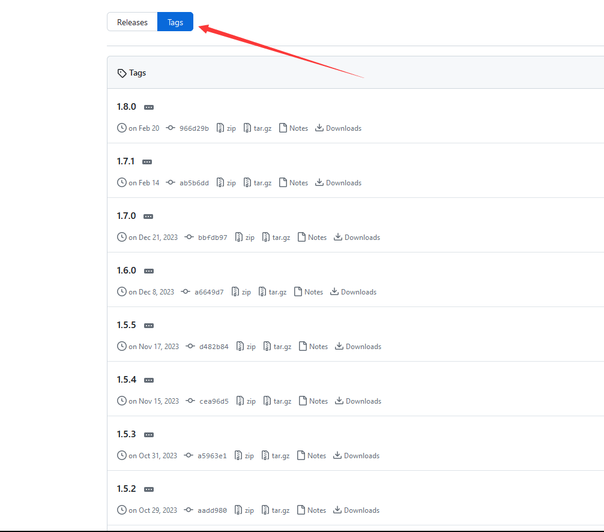

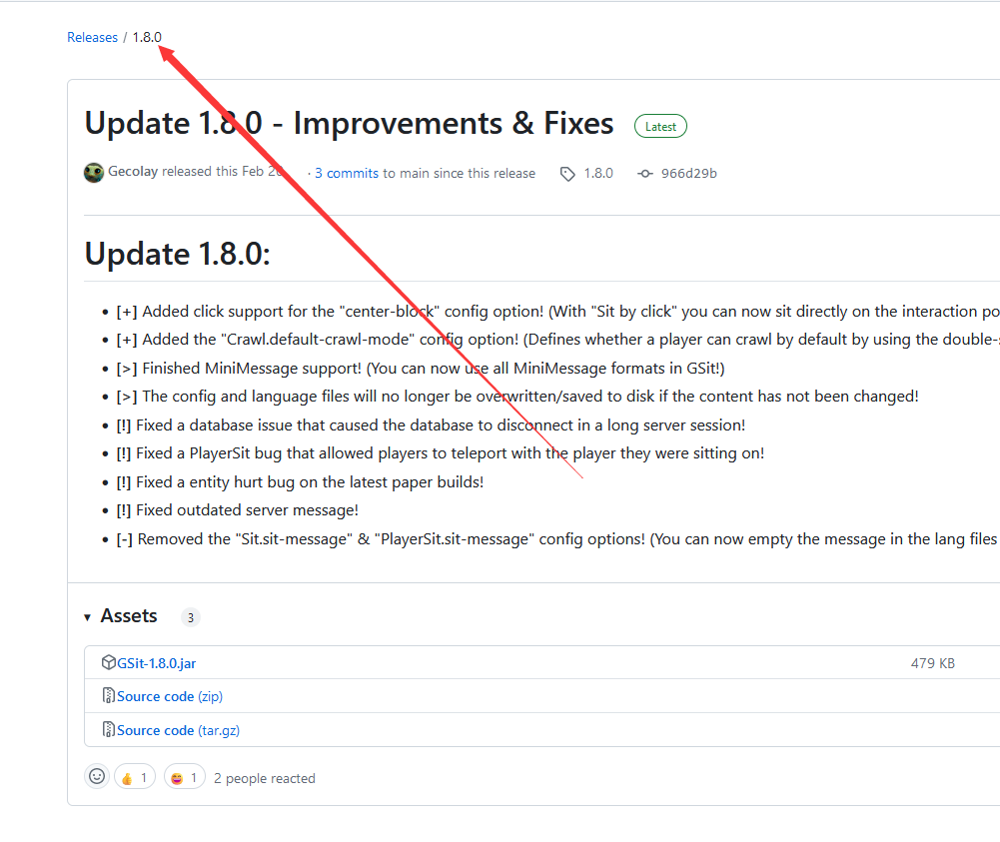


</details>

## 如何安装插件?

将插件的jar文件放入服务端的 `plugins` 文件夹

## 如何寻找插件?

TODO

## 如何查看插件支持的语言?

<details>
<summary>spigotmc</summary>

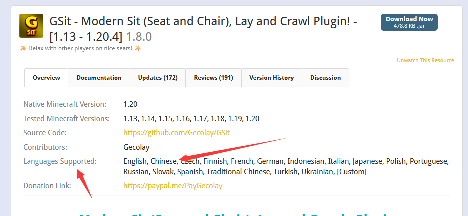


</details>

<details>
<summary>目录下有文件夹</summary>

插件文件夹中有Language,lang之类的文件夹(或其他东西?)

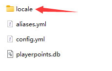

找 zhcn,zh-cn,zh-CN,chinese 等字眼

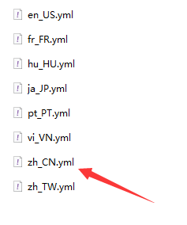


</details>

## 如何汉化插件?

以下是你可能遇到的情况

<details>
<summary>插件自己动♂</summary>

像luckperms,essentials,你机器的语言设置成简体中文即可

</details>

<details>
<summary>配置文件改语言</summary>

像HoloMobHealth,Gsit,你可以在插件配置文件中(一般在config.yml中)找到Language,lang等字眼

然后把把后面改成 zhcn,zh-cn,zh-CN,chinese 啥的,具体应该写什么这地方的注释可能提到,没提到那得靠你自己寻找了

比如**有时**可以用压缩软件打开插件jar文件找找

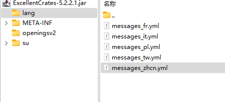

</details>

<details>
<summary>自行汉化</summary>

有些插件不提供别的语言,只提供一个语言文件 如 lang.yml,message.yml

就需要你自行汉化里面的内容了,去一些论坛翻翻也许能找到别人分享的汉化

#### GPT汉化?

口令参考

```
请将我给出的以yml格式存储的Minecraft插件的配置文件汉化，且不改变本身的可执行性，其中被两个%包裹的为变量请不要翻译，请翻译时不要带翻译腔，而是要翻译得自然、流畅和地道，使用优美和高雅的表达方式并代入Minecraft游戏内进行翻译，翻译后请以markdown代码块的格式发送

```

备注：本教程并非推荐服主通过 GPT 等 AI 进行机翻，我们不对服主利用 AI 产生文本的行为及其内容负责。
在正常 Minecraft 服主群体中，使用 GPT 会被视作一种经济但欠缺考虑的行为，若有能力或财力充足，请尽力贡献人工翻译或自行翻译，万不可直接交由机翻，否则可能会对玩家的游玩体验造成极大的损害。

</details>

<details>
<summary>内核汉化</summary>

如果你要用的这个插件没有以上所提到的所有情况...

他**可能**把你要改的语言直接写死在代码里了,你要自己去改代码

</details>

## 插件缩写

<details>
<summary>点击查看</summary>

AP 通常指楠木的 AttributePlus

ilo 通常指 ItemLoreOrigin

SX 通常指 SX-Attribute

MV 通常指 Multiverse-Core 2

Ady 通常指坏黑的 Adyeshach

NI 通常指 Neige 的 NeigeItems

MI 通常指 MyItems 或 MMOitems

Zap 通常指坏黑的 Zapkiel

trm 通常指 Arspale/Score9 的 TrMenu

trc 通常指 Arspale/Score9 的 TrChat

lp 通常指 LuckPerms

gm 通常指 GroupManager

龙核 通常指 DragonCore 等系列开头的插件

萌芽 通常指 萌芽引擎

ds 不常见，通常指 bbs内没有的 屌丝系列插件

dp 通常指楠木的 DungeonPlus

pex 通常指 PermissionEX

mm 通常指 MythicMobs

res 通常指 Zrips 团队的 Residence

ess/essx 通常指 Essentials/EssentialsX

ae 通常指 AdvancedEnchantments

eco 通常指 EcoEnchants，腐竹圈只对 Auxlior 家的附魔感兴趣，大部分没有接触过他的其他插件

hd 通常指 HolographicDisplays

dh 通常指 DecentHolograms

gd 通常指 GriefDefender

ia 通常指 ItemsAdder

dm 通常指 DeluxeMenus

cls 通常指 ClearScreen

tm 通常指 TitleManager

tab 通常指 Nemzamy 的 Tab Reborn

qs 一般指 鬼畜畜 现行维护的 QuickShop-Reremake

we 通常指 WorldEdit

wg 通常指 WorldGuard

fawe 通常指 FasyAsyncWorldEdit

vs 通常指 VoxelSnipper，少见

papi 通常指 PlaceholderAPI

ps 通常指 PlotSquared

pm 通常指 PlayMoney，部分神奇宝贝服会用到

pp 通常指 PlayerPoints

ke 通常指 TabooLib 下的一门脚本语言 Kether

sk 通常指 Skript 或 SkillAPI

ils 通常指 ItemLoreStats

oa 通常指 OriginAttribute

cc 通常指 ChestCommands 或 CrazyCrates

ncp 通常指 NoCheatPlus

mw 通常指 MultiWorld

mma 通常指 MythicArtifacts

wb 通常指 WorldBorder

sb 通常指的是计分板一类的插件

rli 指的是 弱鸡绿毛怪 开发的 RevivedLocyItems

chem 通常指坏黑的 Chemdah

bq 通常指 BetonQuests

mq 通常指 MangoQuests

aac 通常指 AdvancedAntiCheat

iv 通常指 InteractionVisualizer

btlp 通常指 BungeeTablistPlus

pmr 通常指 楠木的 PMRewards

plt 通常指米饭的 PlayerTitle


其他：

shem 通常指建筑结构格式 .schematic，偶见

js 通常指 JavaScript
</details>

## 检查插件安装

使用 `/plugins`或者`/pl` 列出插件列表

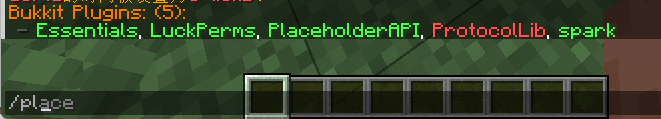

绿色为已加载 (不是代表你日后使用不报错,只是这里加载上了)

红色为加载失败 (服务端检测到了这个插件,但是没加载上,去控制台看看报错)

如果这里没有你的插件...服务端甚至没识别这是个插件,去看看你的文件有啥问题