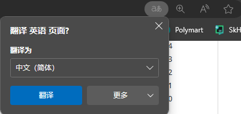
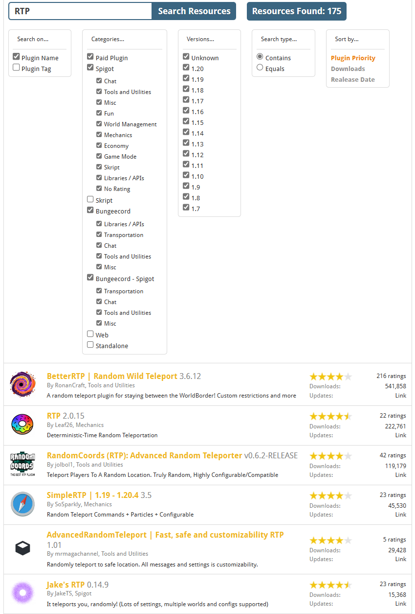
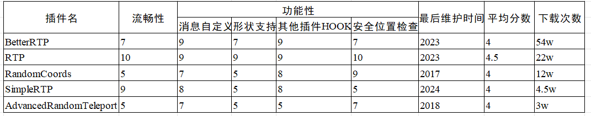
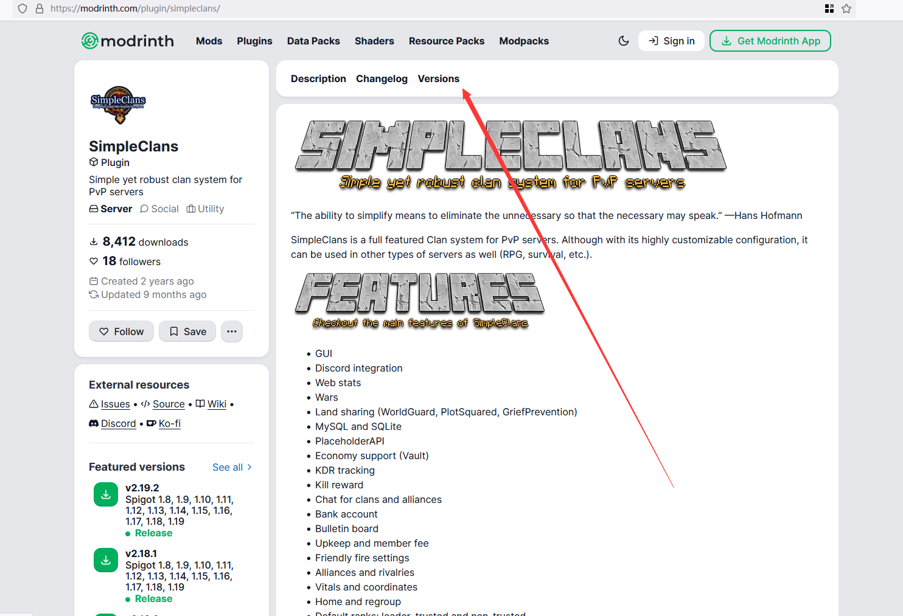
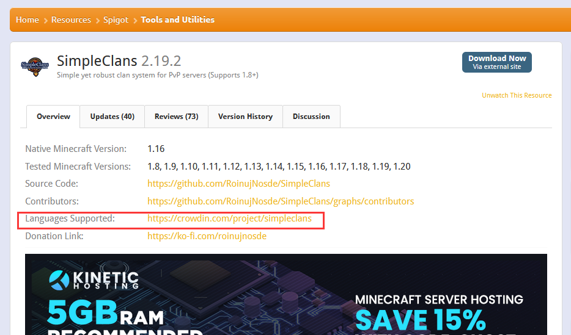
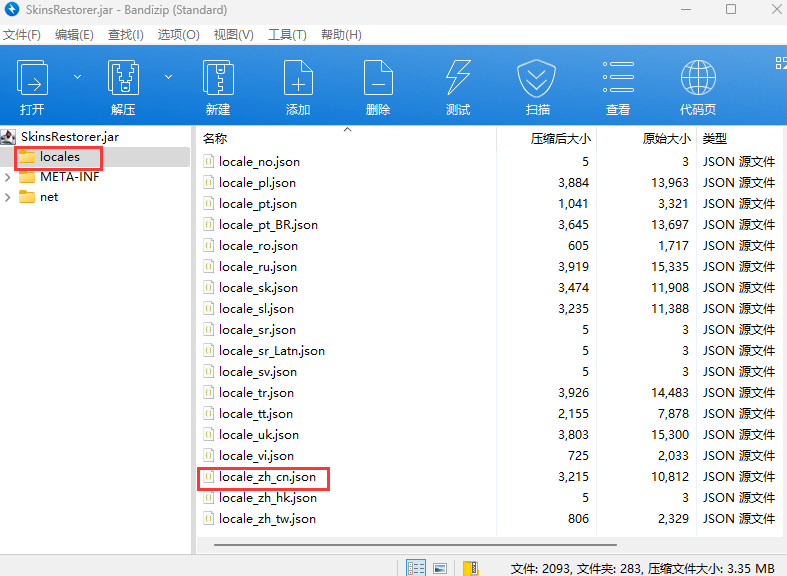

# 概览

本文档中提到的插件都有较多用户基础和完善的 Wiki，具体插件请查看插件的 Wiki。


**建议阅读**

- [YAML 语法](/docs/扩展阅读/YAML语法/概览.md)     - 了解你书写配置的语法
- [plugin.yml](/docs/扩展阅读/plugin.yml.md)     - 了解插件的一些信息

:::danger

服务器在**开发阶段**可以使用 PlugmanX，ServerUtils 等插件热重载插件，

过了开发阶段后切记，多数插件自带了重载（如 Placeholder 的重载指令为：papi reload）

尽量少使用插件重载插件，因为如果插件本身并不支持热重载，即使热重载了也容易出问题。

:::

## 如何安装插件？

将插件的 jar 文件放入服务端的 `plugins` 文件夹

### 笨蛋脚本

下载此[脚本](https://github.com/lilingfengdev/NitWiki-Script/releases/download/latest/auto-install-depend.exe)，我们会为你安装常用插件(自动)

<details>
    <summary> 安装的插件列表 </summary>

* ProtocolLib 必备前置
* Luckperms 权限管理插件
* PlaceholderAPI 必备前置
* PlugManx 插件管理
* WorldEdit 创世神
* EssentialsX 基础插件
* Multiverse-Core 世界管理
* ViaVersion，ViaBackwards 跨版本
* AuthMe 登陆插件
* spark 性能分析
* SkinRestorer 皮肤管理/皮肤修复

<details>

## 如何进行插件选择？

很好，相信你已经在[可能用到的网站](/docs/准备工作/可能用到的网站.md)看到了很多链接， 面对成千上万的插件我们应该如何进行选择呢？

我们在此以spigot.org为例(假设您已经注册成功)， 讲解如何选择插件.

1. (*可选，推荐*)安装一个spigot专用的[搜索引擎](https://fof1092.de/Plugins/SSE/Redirect/)， 作为浏览器插件安装即可. 使用spigot search engine(spigot搜索引擎)后， 你能得到比spigot自带的搜索相关性强得多的搜索结果.

2. (*可选*)如果你觉得大量的英语很头大， 请打开你的浏览器自带的翻译器， 如edge/chrome


3. 就像逛淘宝一样， 根据你的需求将你认为有用的插件收藏起来. 最好是分门别类放在一起， 我们以随机 TP 插件为例， 我们在此搜索 RTP

<details>
    <summary>安装搜索引擎后应该长啥样？</summary>



</details>

4. 查看这些插件的下载次数、最后更新时间、评价分数、插件特性、语言支持、是否开源、是否付费等. 如果符合以下的标准， 可以尝试下载几个并收藏这些插件(建议同类型插件选择大概3-5个最后选一个).

:::info

对于大多数插件， 选择人数较多(同类型插件前50%)， 更新维护更频繁， 用户评价多且平均分高， 插件特性满足需要(注意不是越多越好)

支持语言切换甚至直接支持全中文翻译， 开源， 免费的插件对于大多数服主来说是合理的.

:::

5. 将选好的同类型插件安装到服务器测试一下， 是否有bug， 是否特性能满足需求.

6. 如果你不嫌麻烦， 可以在 Excel 中分析插件的优劣并打分， 如图比较了当前下载量前5的随机TP插件. 每个服务器可根据自己的需求自行评价， 下图只是一个抛砖引玉的作用， 如果你看重粒子效果/title/音效等依然可以加入到表格中， 然后根据自己的需求选择其中一个即可， ***不要装多个同类型插件如CMI/ESS一起装***


## 如何下载插件历史版本？

**建议**您用**最新版本**的插件，但如果您因为一些原因必须要用旧版的话...

<details>
    <summary>Bukkit</summary>


点击左侧文字可以查看详细内容


这是更新日志


</details>

<details>
    <summary>SpigotMC</summary>


</details>

<details>
    <summary>GitHub</summary>

在 Releases 中往下翻


或者这样子


</details>

<details>
    <summary>Modrinth</summary>



</details>

## 如何查看插件支持的语言？

<details>
    <summary>SpigotMC</summary>


</details>

<details>
    <summary>目录下有文件夹</summary>

插件文件夹中有Language，lang，locale之类的文件夹(或其他东西？)


找 zhcn，zh-cn，zh-CN，chinese 等字眼


然后一般要去插件配置文件把语言改成这里的文件名(此处为zh_cn)

</details>

<details>
    <summary>Crowdin</summary>

比如 https://www.spigotmc.org/resources/simpleclans.71242/

可以看到，语言那里给了个网站



https://crowdin.com/project/simpleclans

看到有 Chinese Simplified chinese zh_cn zh_CN 之类的字眼就行

</details>

<details>
    <summary>拆开插件jar文件</summary>

比如 SkinsRestorer

在插件文件夹找不到语言文件夹



</details>

还有它可能写在插件文档里，在项目README里，在配置文件的注释里

## 如何配置插件？

插件的配置文件一般在 `/plugins/插件名字/` 文件夹中，常见的配置文件一般是 `config.yml` 。

:::warning

请务必保证你已经完全了解 YAML 语法，否则你会遇到大量的报错！

:::

我们在开始前所做的准备工作中，推荐你安装任意一款推荐的文档编辑软件。

（如果你还没有安装，请立刻查看[准备工作](/docs/%E5%87%86%E5%A4%87%E5%B7%A5%E4%BD%9C/%E6%96%87%E6%9C%AC%E7%BC%96%E8%BE%91%E5%99%A8.md)）

如果你是 Windows ，现在让我们双击 .yml 文件就可以开始修改配置文件了！

如果你是 Linux ，如果你认为这很难操作，可以通过 SFTP 下载到自己的电脑上编辑。

## 如何汉化插件？

以下是你可能遇到的情况

<details>
    <summary>插件自己动♂</summary>

像luckperms，essentials，你服务器和客户端的语言设置成简体中文即可

</details>

<details>
    <summary>配置文件改语言</summary>

像 HoloMobHealth ，Gsit ，你可以在插件配置文件中(一般在 config.yml 中)找到 Language ， lang 等字眼

然后把把后面改成 zhcn，zh-cn，zh-CN，chinese 啥的，具体应该写什么这地方的注释可能提到，没提到那得靠你自己寻找了

比如**有时**可以用压缩软件打开插件jar文件找找


</details>

<details>
    <summary>自行汉化</summary>

有些插件不提供别的语言，只提供一个语言文件 如 lang.yml，message.yml

就需要你自行汉化里面的内容了，去一些论坛翻翻也许能找到别人分享的汉化

#### GPT汉化？

口令参考

```
请将我给出的以 yml 格式存储的 Minecraft 插件的配置文件汉化，且不改变本身的可执行性，其中被两个 % 包裹的为变量请不要翻译，请翻译时不要带翻译腔，而是要翻译得自然、流畅和地道，使用优美和高雅的表达方式并代入 Minecraft 游戏内进行翻译，翻译后请以 markdown 代码块的格式发送
```

备注：本教程并非推荐服主通过 GPT 等 AI 进行机翻，我们不对服主利用 AI 产生文本的行为及其内容负责。
在正常 Minecraft 服主群体中，使用 GPT 会被视作一种经济但欠缺考虑的行为，若有能力或财力充足，请尽力贡献人工翻译或自行翻译，万不可直接交由机翻，否则可能会对玩家的游玩体验造成极大的损害。

</details>

<details>
    <summary>内核汉化</summary>

如果你要用的这个插件没有以上所提到的所有情况...

他**可能**把你要改的语言直接写死在代码里了，你要自己去改代码

</details>

## 检查插件安装

使用 `/plugins`或者`/pl` 列出插件列表


绿色为已加载（不是代表你日后使用不报错，只是这里加载上了）

红色为加载失败（服务端检测到了这个插件，但是没加载上，去控制台看看报错）

如果这里没有你的插件...服务端甚至没识别这是个插件，去看看你的文件有啥问题

## 插件缩写

<details>
    <summary> 常见插件缩写，点击查看 </summary>

AP 通常指楠木的 AttributePlus

ilo 通常指 ItemLoreOrigin

SX 通常指 SX-Attribute

MV 通常指 Multiverse-Core 2

Ady 通常指坏黑的 Adyeshach

NI 通常指 Neige 的 NeigeItems

MI 通常指 MyItems 或 MMOitems

Zap 通常指坏黑的 Zapkiel

trm 通常指 Arspale/Score9 的 TrMenu

trc 通常指 Arspale/Score9 的 TrChat

lp 通常指 LuckPerms

gm 通常指 GroupManager

龙核 通常指 DragonCore 等系列开头的插件

萌芽 通常指 萌芽引擎

ds 不常见，通常指 bbs内没有的 屌丝系列插件

dp 通常指楠木的 DungeonPlus

pex 通常指 PermissionEX

mm 通常指 MythicMobs

res 通常指 Zrips 团队的 Residence

ess/essx 通常指 Essentials/EssentialsX

ae 通常指 AdvancedEnchantments

eco 通常指 EcoEnchants，腐竹圈只对 Auxlior 家的附魔感兴趣，大部分没有接触过他的其他插件

hd 通常指 HolographicDisplays

dh 通常指 DecentHolograms

gd 通常指 GriefDefender

ia 通常指 ItemsAdder

dm 通常指 DeluxeMenus

cls 通常指 ClearScreen

tm 通常指 TitleManager

tab 通常指 Nemzamy 的 Tab Reborn

qs 一般指 鬼畜畜 现行维护的 QuickShop-Reremake

we 通常指 WorldEdit

wg 通常指 WorldGuard

fawe 通常指 FasyAsyncWorldEdit

vs 通常指 VoxelSnipper，少见

papi 通常指 PlaceholderAPI

ps 通常指 PlotSquared

pm 通常指 PlayMoney，部分神奇宝贝服会用到

pp 通常指 PlayerPoints

ke 通常指 TabooLib 下的一门脚本语言 Kether

sk 通常指 Skript 或 SkillAPI

ils 通常指 ItemLoreStats

oa 通常指 OriginAttribute

cc 通常指 ChestCommands 或 CrazyCrates

ncp 通常指 NoCheatPlus

mw 通常指 MultiWorld

mma 通常指 MythicArtifacts

wb 通常指 WorldBorder

sb 通常指的是计分板一类的插件

rli 指的是 弱鸡绿毛怪 开发的 RevivedLocyItems

chem 通常指坏黑的 Chemdah

bq 通常指 BetonQuests

mq 通常指 MangoQuests

aac 通常指 AdvancedAntiCheat

iv 通常指 InteractionVisualizer

btlp 通常指 BungeeTablistPlus

pmr 通常指 楠木的 PMRewards

plt 通常指米饭的 PlayerTitle

</details>