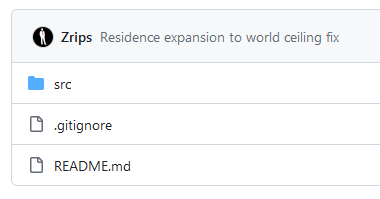

# Residence

:::info

`spigotmc` :https://www.spigotmc.org/resources/.11480/

`GitHub` :https://github.com/Zrips/Residence

`文档`:https://www.zrips.net/residence/

`插件百科` :https://mineplugin.org/Residence

`Bukkit(太老了不要用)` :https://dev.bukkit.org/projects/residence

`curseforge(太老不要使用)` :https://www.curseforge.com/minecraft/bukkit-plugins/residence

:::

老牌领地插件

## 免费下载?

可以免费下载,自己去spigotmc帖子找地址（就是大大的 About 上面那个黄色的 here）

## 前置?

Residence 需要前置插件 CMIlib

https://www.spigotmc.org/resources/cmilib.87610/

https://www.zrips.net/cmilib/

## 开源?

只有src 没构建脚本,就是说你不能构建出jar文件

不如说是假开源

