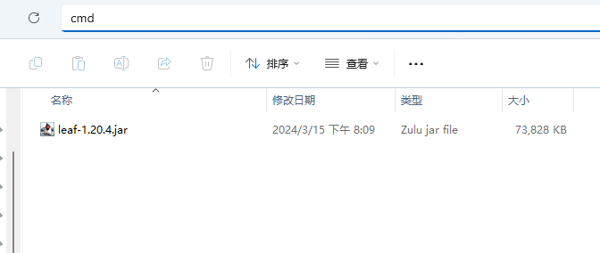
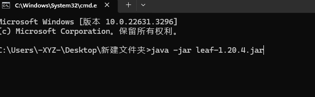
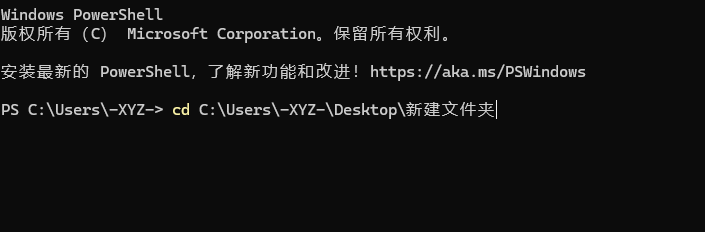

# 开启服务端

你已经做好了准备工作，开始启动你的服务器了

<details>
<summary>不会讲，这一段以后再说，你接着往下看</summary>

## 终端路径

就像你的文件资源管理器


(估计有人不知道文件资源管理器是什么，所以放张图)

有路径一样，你的cmd也是有路径的，

## 启动命令

~~最简单的启动命令当然是java -jar~~

现在你把下载好的服务端核心放到一个空文件夹里



点击地址栏，输入cmd然后回车，就会在这个路径下打开cmd



或者用别的办法打开cmd，然后用cd命令切换路径



</details>

## 编写启动脚本

~~最简单的启动命令当然是java -jar~~

现在你把下载好的服务端核心放到一个空文件夹里


在这个文件夹里创建一个txt文件，重命名为bat后缀的文件 如 `run.bat`

[文件看不到后缀怎么办](https://cn.bing.com/search?q=%E6%96%87%E4%BB%B6%E7%9C%8B%E4%B8%8D%E5%88%B0%E5%90%8E%E7%BC%80)

用你前面下的文本编辑器编辑这个文件，写入以下信息

```
java -Xms1G -Xmx2G -jar 核心名.jar --nogui
```

### 解释

| 单词 | 解释 |
| --- | ----------- |
| java | 启动java虚拟机 |
| -Xms1G | 设置初始内存大小为 1GB 可自行调整 |
| -Xmx2G | 设置最大堆内存大小为 2GB 可自行调整 |
| -jar 核心名.jar | 这部分告诉 Java 程序去运行一个叫做 核心名.jar 的 JAR 文件 |
| --nogui | 不显示GUI |

保存，然后双击它

[卡在Downloading mojang_x.x.x.jar怎么办](/docs/常见问题.md)

他会提示你
> You need to agree to the EULA in order to run the server. Go to eula.txt for more info.

用文本编辑器打开此目录下生成的 `eula.txt`

将里面的 `eula=false` 改为 `eula=true`

eula就像是用户协议一样的东西你想知道讲了啥，点[这里](https://zhuanlan.zhihu.com/p/463084883)

改好之后重新开启服务器

当出现

> Done (6.554s)! For help, type "help"

的字样说明服务器已经开启


## 更复杂的bat

你可以用 http://flags.sh/ 或 https://startmc.jakaco.xyz/ 来做优化的启动命令


:::tip

下面这个bat会自动下载[Leaf](/docs/准备工作/服务端核心选择.md)

修改
set jar=leaf-1.20.4.jar

set tag=ver-1.20.4

可以更改下载的核心的版本

:::

```
rem 注释

rem 关闭回显
@echo off

rem 设置编码为UTF-8
chcp 65001

title 此处设置窗口标题

set jar=leaf-1.20.4.jar
set tag=ver-1.20.4
rem 检查此脚本所在的目录中有没有核心
if exist %jar% (
    echo %jar%已存在,正在开启服务端
) else (
    :downloadJAR
    echo 正在从 https://github.com/Winds-Studio/Leaf/releases/download/%tag%/%jar% 下载最新的%jar% 请稍候...
    curl -L -o %jar% https://github.com/Winds-Studio/Leaf/releases/download/%tag%/%jar%
    echo %jar% 下载完成!
)

java -Xms1G -Xmx2G --add-modules=jdk.incubator.vector -XX:+UseG1GC -XX:+ParallelRefProcEnabled -XX:MaxGCPauseMillis=200 -XX:+UnlockExperimentalVMOptions -XX:+DisableExplicitGC -XX:+AlwaysPreTouch -XX:G1HeapWastePercent=5 -XX:G1MixedGCCountTarget=4 -XX:InitiatingHeapOccupancyPercent=15 -XX:G1MixedGCLiveThresholdPercent=90 -XX:G1RSetUpdatingPauseTimePercent=5 -XX:SurvivorRatio=32 -XX:+PerfDisableSharedMem -XX:MaxTenuringThreshold=1 -Dusing.aikars.flags=https://mcflags.emc.gs -Daikars.new.flags=true -XX:G1NewSizePercent=30 -XX:G1MaxNewSizePercent=40 -XX:G1HeapRegionSize=8M -XX:G1ReservePercent=20 -jar %jar% --nogui

rem 让脚本程序暂停，会打印输出 “请按任意键继续...”字样，防止cmd一闪而过什么都没看到
pause
```
