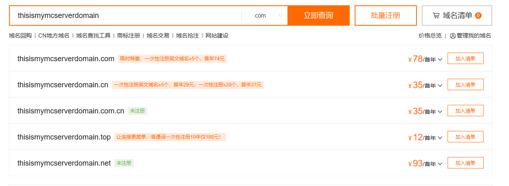
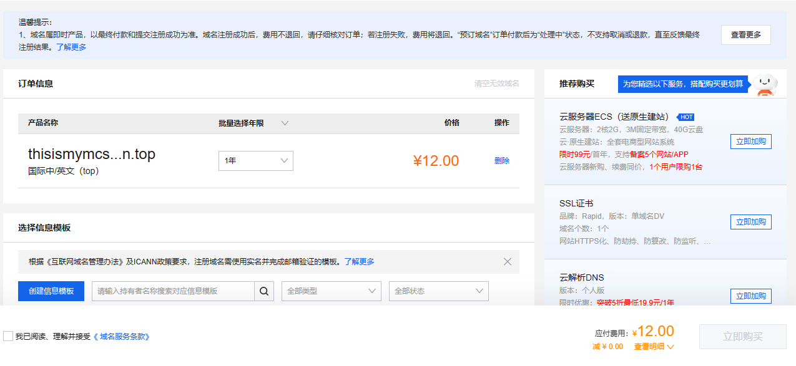

# 申请域名

## 寻找合适的域名提供商查询域名
百度即可，这里以阿里云的[万网](https://domain.aliyun.com/)为例
首先打开网站，来的如下页面：

搜索你想要的域名

:::tip

此处域名价格为你输入域名的人气决定，名称越热门越贵，没有优惠最便宜首年也这个价

:::

:::warning

不要看有些域名首年很便宜，可能第二年续费要成百上千，不放心可以鼠标悬停在价格旁边的倒三角处查看续费价格，这里推荐.top，第二年价格最低，长期开服绝对推荐

:::
## 购买域名
登录后点击域名旁边的加入清单，然后点批量注册旁边的域名清单，更改域名购买时间后，最好底下什么套餐都不要选，直接点立即购买

跳转后这个页面立即购买是点不动的，滑动到下方，点击创建信息模板来实名验证

:::tip

此操作未成年也可以，但无论如何信息需要真实（通讯地址似乎不用太精确，填到市就能过了），请不要拿着他人的身份证假冒认证！

:::

点提交后等通过，然后回来勾选最底下的我已阅读、理解并接受《域名服务条款》

在下一个页面选择支付方式后点支付

:::tip

域名刚购买需要等0~2天才能正常解析，打开网址 https://whois.aliyun.com/domain/ +你的域名，如果域名状态那里是正常状态（ok）就代表可以使用了

:::
## 域名解析
打开网址[阿里云域名控制台](https://dc.console.aliyun.com/#/domain-list/all)，找到你的域名点右边蓝色字的解析，点击添加记录，记录类型选择 SRV，然后主机记录填_minecraft._tcp.你想要的二级域名，记录值填5 0 端口号 目标地址，点击确认，等一会，你就可以发现直接用域名可以连接上你的服务器了

:::tip

此方法不可转发其他服务，原理就是标记一下，告诉客户端说，这里有服务器哦，然后客户端去连那个ip去了，而且缺点很明显，会暴露真实ip端口

:::
