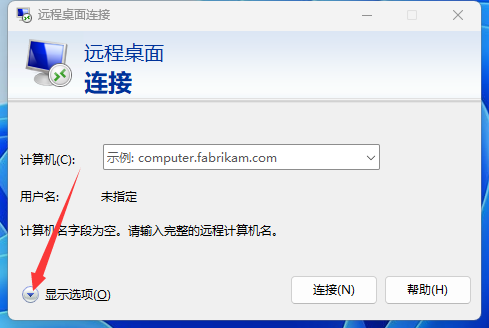
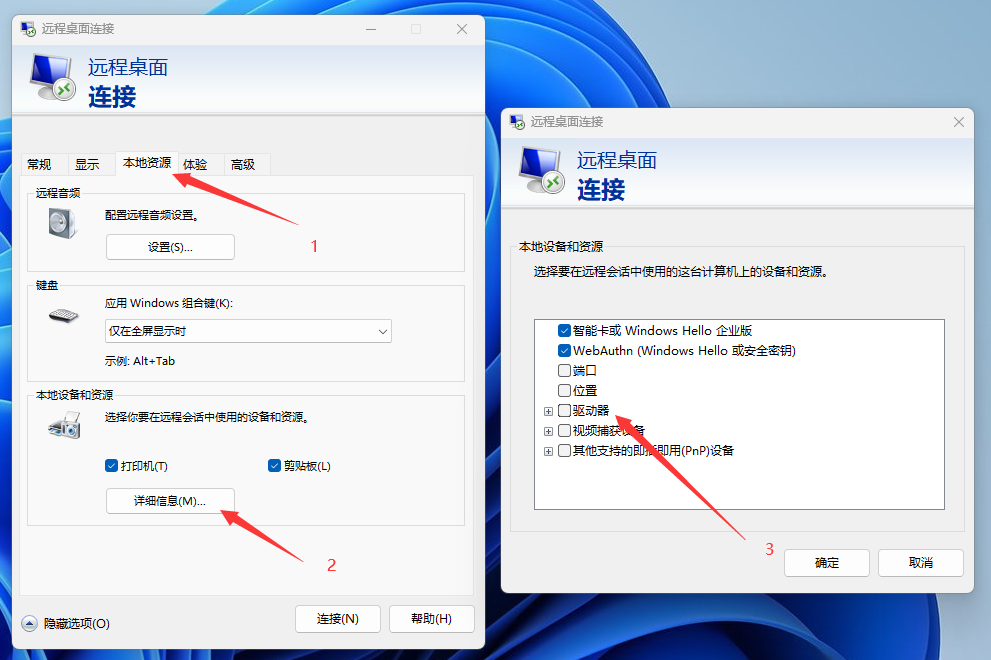

# 连接服务器

## 端口

打开你服务器根目录的 `server.properties`

找到

```yaml
server-port=25565
```

`25565` 即mc服务器的默认端口，如果不更改默认端口通常可省略不写

## 本地连接

:::tip

此方法适用于你服务端和客户端在同一机器上的情况

:::

**回环地址**用来表示本机IP，通常有这样几种形式

- localhost
- 127.0.0.1
- 0.0.0.0

如果你没有修改你的服务器端口，那么在你的mc客户端中:

1. 点击多人游戏
2. 点击添加服务器
3. 输入上面提到的回环地址中的任意一个
4. 点击完成
5. 进入服务器

如果你修改了你的服务器端口，在回环地址后面加个冒号加上你改的端口即可

如:

- localhost:25566
- 127.0.0.1:25566
- 0.0.0.0:25566

:::warning

这里要使用英文的 `:` 不能使用中文的 `：` ！

:::

## 面板

去骚扰卖你面板的人

## vps

<details>
  <summary>远程桌面连接</summary>

按下 `win键` + `R键`


在弹出的窗口中输入 `mstsc`

把卖你vps的人给你的信息照着填进去就可以连接到你的vps了。

你也可以在vps安装 [ToDesk](https://www.todesk.com/download.html) 或 [向日葵远程控制](https://sunlogin.oray.com/) 等软件

#### 映射驱动器

可以在vps中点击 `此电脑` 看到本地的 **驱动器**（c盘d盘的，这下听懂了吧）

方便你传输文件





</details>

#### 放行端口

然后你需要在防火墙放行你mc服务端使用的端口，可参考教程：https://blog.csdn.net/aa1213366512/article/details/119964839

接着用外网地址连接你的服务器

**举例，不一定正确：**

你远程桌面连接用的是 yizhan.wiki:12345

你的服务商告诉你，你可以使用 12346 端口

那你就把你服务端的 [端口](#端口) 设置为 12346 ，记得 [放行端口](#放行端口)

然后在你的游戏客户端里添加服务器，填地址为 yizhan.wiki:12346

## 家里云

<details>
  <summary>我有公网ip</summary>

TODO

</details>

<details>
  <summary>我没有/不知道啥是公网ip</summary>

todo

</details>