# 设置ACCESS_TOKEN

* 点击右上角你的头像

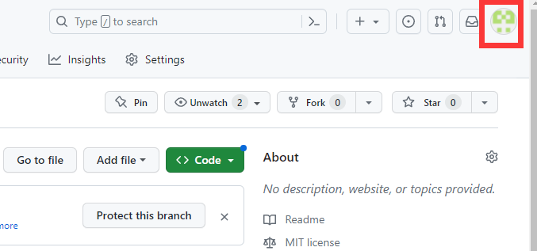

* 点击下方的`Settings`按钮

* 点击左下方的`Developer settings`按钮

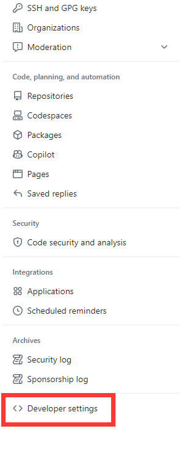

* 点击左侧的`Personal access tokens`按钮

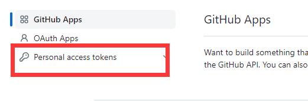

* 点击`Tokens (classic)`按钮

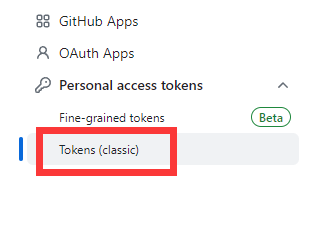

* 点击右上方的`Generate new token`按钮

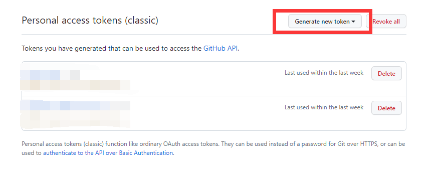

* 点击`Generate new token (classic)`按钮

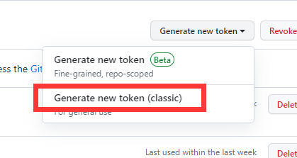

* `Note`里填用途, 用于提醒你这是干什么的, 你可以直接填项目名称, 比如`XXX-Wiki`

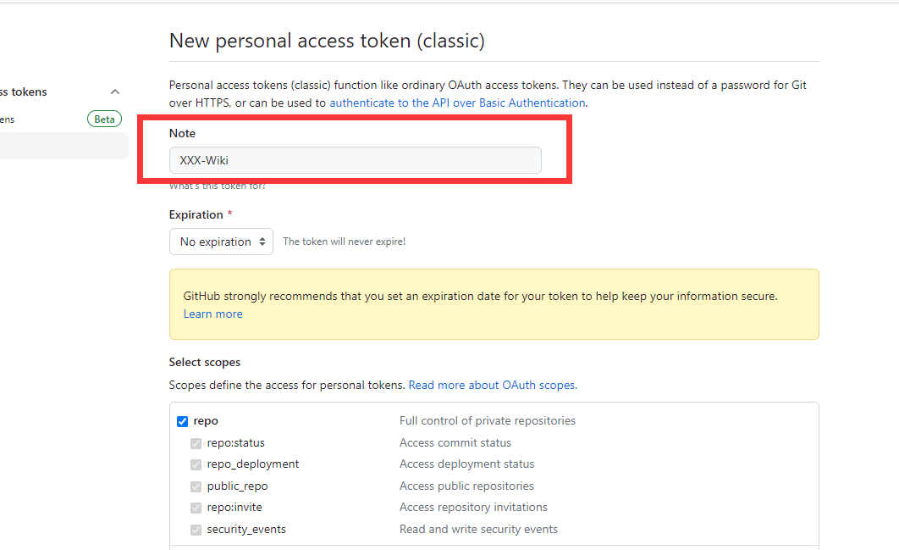

* 将其设置为永不过期

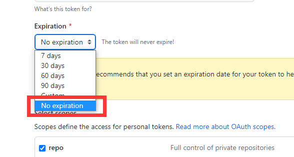

* 勾选`repo`下的所有选项

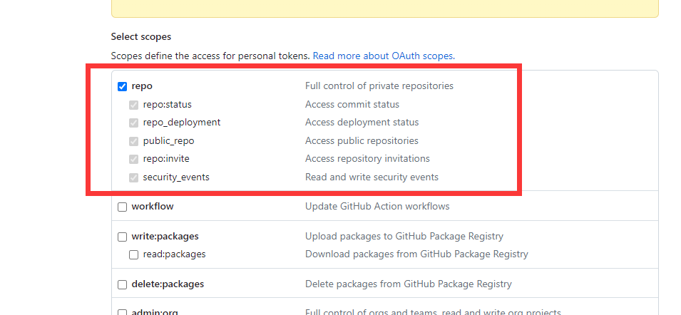

* 点击最下方的`Generate token`按钮

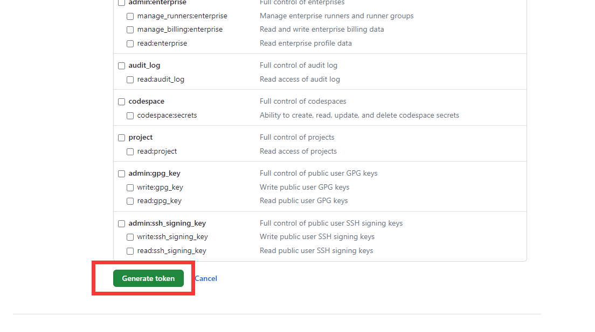

* 复制生成的token(关闭页面后你就再也无法查看它了)

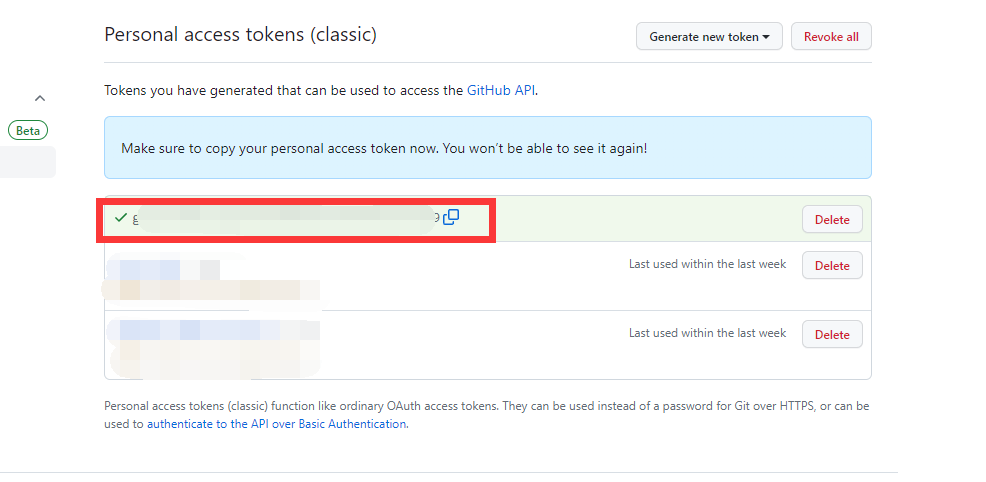

* 回到`XXX-Wiki`仓库页面

* 点击右上角的`Settings`按钮

* 点击左下方的`Secrets and variables`按钮

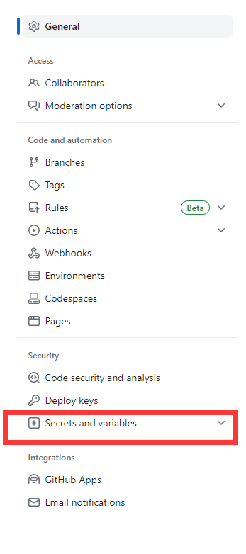

* 点击`Actions`按钮

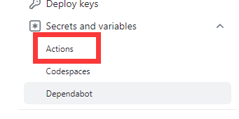

* 点击右上角绿色的`New repository secret`按钮

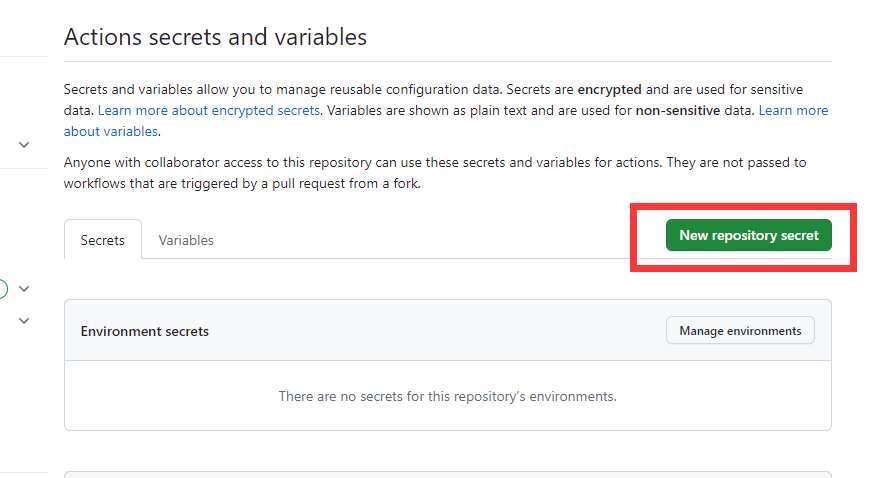

* `Name`填写`ACCESS_TOKEN`, `Secret`填写你刚才复制的东西

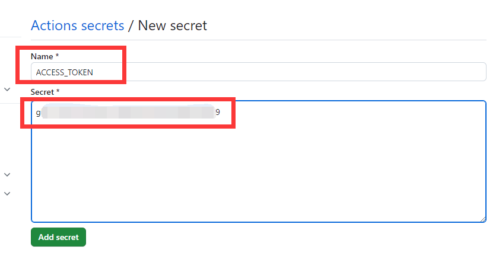

* 点击下方绿色的`Add secret`按钮

