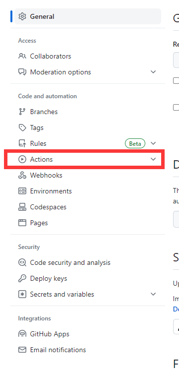
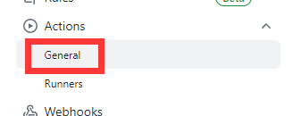
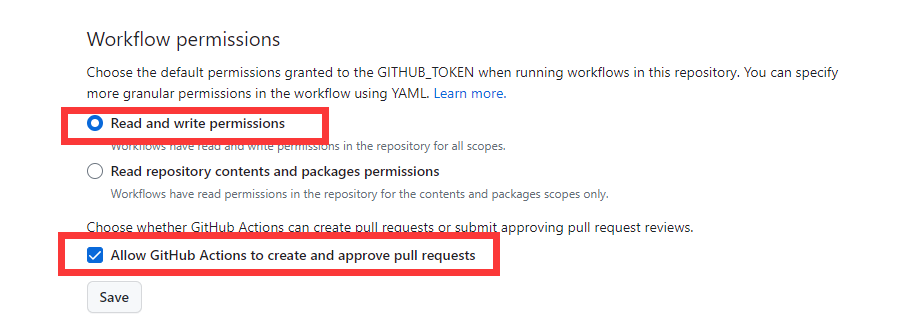
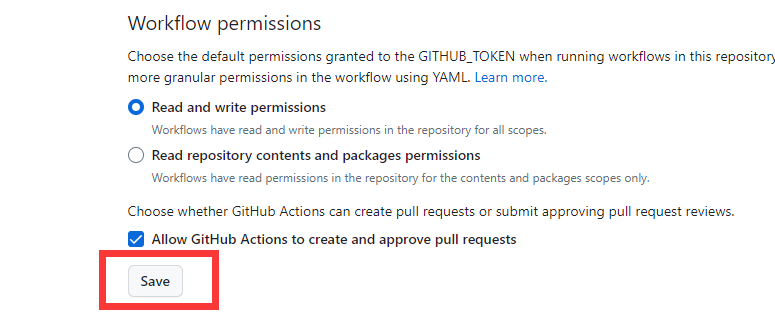

# 设置Action权限

* 回到`XXX-Wiki`仓库页面

* 点击右上角的`Settings`按钮

* 点击左侧的`Actions`按钮

* 点击`General`按钮

* 翻到最下方的`Workflow permissions`部分

* 勾选`Read and write permissions`

* 勾选`Allow GitHub Actions to create and approve pull requests`

* 点击`Save`按钮

